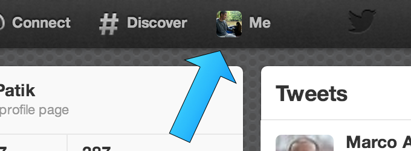
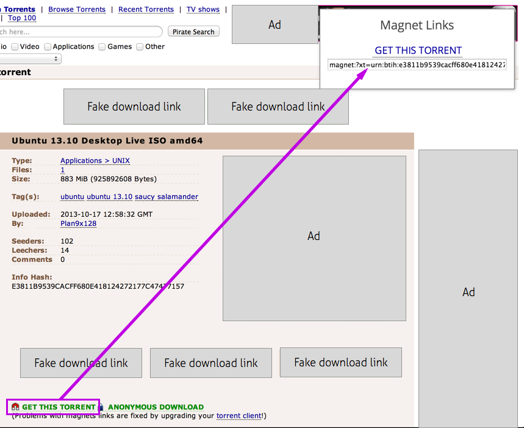

# User Scripts

Simple scripts and extensions for modifying the way web sites work

## Twitter Menu Avatar

See which account you're logged in under at a quick glance.

Install from the [Chrome Web Store](https://chrome.google.com/webstore/detail/twitter-menu-avatar/kjfgnlaebgjcpmmccahmkddkmhepgcoi)

## Magnet Link Finder

Install from the [Chrome Web Store](https://chrome.google.com/webstore/detail/magnet-link-finder/abpldoibicdphclboplcndcialclbpib)

Displays `magnet://` links and other P2P URLs prominently. Great for sites that hide the real links between obnoxious "download" ad banners or open pop ups when you click on them.

